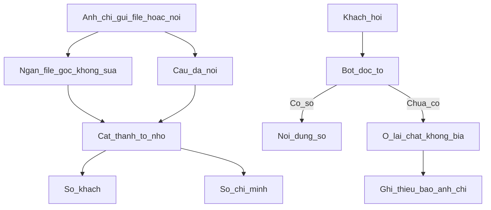

# Sổ shop, vùng kiến thức, dữ liệu khách

Chữ thường cho chủ shop. Người dựng viết file theo
[`knowledge/CLAUDE.md`](../knowledge/CLAUDE.md) và danh sách tờ
[`wiki/TRANG-MAU.md`](../knowledge/wiki/TRANG-MAU.md).

Bot **không lên mạng đoán giá shop**. Số khách nghe chỉ lấy từ miệng anh/chị
và tài liệu anh/chị đưa. File nằm Drive: người dựng lấy bằng cầu MCP — chủ chỉ
đúng thư mục, xem [`11-mcp-ung-dung.md`](11-mcp-ung-dung.md).

---

## Ba ngăn kiến thức

Nghĩ như tủ hồ sơ, không phải phần mềm kế toán.

| Ngăn | Anh/chị hiểu là | Khách được nghe? |
|---|---|---|
| **File gốc** | Ảnh / PDF / Excel anh/chị gửi, giữ nguyên | Không. Bot không bảo “xem file đính kèm” |
| **Sổ khách** | Tờ nhỏ: giá, ship, đổi trả, còn hàng… | Có — đúng chữ trên tờ |
| **Sổ chỉ mình** | Giá vốn, hoa hồng, cách xử khách khó | Không. Bot không nhắc là có ngăn này |

Người dựng gọi tắt: file gốc = `knowledge/raw/` · sổ khách = `wiki/public/` ·
sổ chỉ mình = `wiki/internal/`. Anh/chị không cần nhớ đường dẫn.

---

## Vùng kiến thức bot được dùng

Ba lớp, **không trộn miệng**:

1. **Chính sách shop** — giá, ship, đổi trả, còn hàng, giờ gọi lại. Chỉ từ sổ.
   Trống / chưa hỏi = không đẻ số, vẫn ở lại chat, hẹn anh/chị chốt.
2. **Kiến thức đời** — phối đồ, dùng hàng thế nào, khái niệm. Được nói, nhưng
   phải tách: “bình thường người ta hay…” ≠ “bên em bảo hành 24 tháng”.
3. **Cách nói / cách hỏi** — giọng Nami, hỏi một câu khi phân vân. Không phải
   giá. Đổi giọng không được bịa thêm chính sách.

Chuyện ngoài shop: tán thật, không kéo về bán hàng. Bảy nhóm không dám (y tế,
pháp lý, tài chính, chính trị, tự hại, người lớn, làm bài hộ): nói thật một câu
rồi chơi tiếp. Không
làm thầy.

---

## Xử lý dữ liệu khi anh/chị đưa tài liệu

Người dựng làm đúng thứ tự này. **Cấm** tự mở website / Facebook shop rồi chép
giá vào sổ khi anh/chị chưa đưa.

1. **Cất nguyên** vào ngăn file gốc. Tên file giữ nguồn (*bang-gia-thang-4.pdf*).
   Không sửa file gốc.
2. **Ghi một dòng nguồn:** ngày nhận, ai gửi, file nào được nói ra / chỉ nội bộ.
3. **Đọc hết**, cắt thành **nhiều tờ nhỏ** — một tờ một câu khách hay hỏi. Tờ
   dài quá thì tách tiếp.
4. Số chỉ lấy từ file **hoặc** miệng anh/chị. File im, miệng chưa nói → để
   “chưa hỏi chủ”, bot chưa được dùng tờ đó để nói số.
5. Phân vân công khai hay nhạy — để **sổ chỉ mình**.
6. Chỉ tạo tờ khi **có chữ**. Tờ trống dễ bị hiểu nhầm (*shop không ship*).

Ảnh menu / screenshot: cất gốc, đọc chữ trong ảnh rồi viết sổ. Nick gửi file
không ổn thì đừng hứa “em gửi file”.

Danh tờ nên có (chỉ khi có dữ liệu): giá, ship, thanh toán, đổi trả, bảo hành,
còn hàng, giờ trực, địa chỉ, sỉ, hoá đơn, kiểm hàng — xem `TRANG-MAU.md`.

---

## Dữ liệu từng khách — không phải phần mềm quản lý đơn

Mỗi người nhắn inbox một **phiếu ngắn** (size đã nói, món đang hỏi, đang tặng
ai…). Bot đọc thầm để khỏi hỏi lại. **Không** đọc phiếu thành tiếng, không nói
“em đã ghi nhớ”.

Không phải CRM, không xuất Excel đơn hàng, không tra “đơn đang ở kho” nếu sổ
không có cách tra.

**Không ghi:** số chuyển khoản, căn cước, mật khẩu, mã OTP, ảnh gốc, số điện
thoại đủ. Ảnh CK: chỉ một dòng *thấy biên lai*, rồi gọi anh/chị — **không** =
đã có tiền, **không** = đã có đơn.

Nhật ký ngày: câu khách hỏi mà sổ chưa có số — để anh/chị bổ sung. Không đưa
file ngày cho khách xem.

---

## Lúc khách đang nhắn, số đi đâu

1. Nhìn tin (và ảnh, nếu có).
2. Mở phiếu người đó nếu đã có.
3. Mở **tờ sổ** đúng việc (giá / ship / đổi trả).
4. Trả **đúng cái họ hỏi** trước. Chắc và nhẹ mới gợi ý thêm một món.
5. Tiền, lỗi hàng, giấy tờ, không chắc món → dừng tư vấn bán, gọi người.
6. Fact bền vừa biết → ghi phiếu. Thiếu số trên sổ → ghi nhật ký ngày, báo
   anh/chị — **không** tự viết giá vào sổ.

Sửa giá lần sau: sửa **tờ sổ**. Phiếu chỉ nhớ size / món của từng người, không
phải bảng giá.

---

## Anh/chị gửi thêm file sau này

Cùng quy trình: cất gốc → cắt tờ → soi lại một câu với khách ảo. Đừng nhắn
“Nami ơi từ giờ ship 40k” rồi quên sổ: Nami có thể nhớ trong đoạn chat đó; khách
khác ngày mai vẫn nghe số cũ.

Follow-up (nhắn khi khách im / sau đơn) lấy giờ và câu mẫu anh/chị điền — chưa
điền thì tắt. Không lấy SĐT trong phiếu để nhắn hàng loạt.
