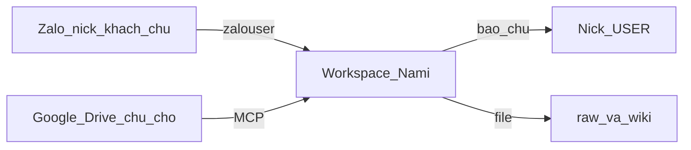

# MCP — nối ứng dụng (Drive, Zalo, sổ)

Coding agent đọc. Chủ shop: “file nằm Drive thì đưa link / mở quyền, em cất vào
sổ” — [`09-kho-va-du-lieu.md`](09-kho-va-du-lieu.md).

MCP = cầu để agent **mượn tool của app khác**. Không phải CRM. Không phải cào web.

## Bus

| Cổng | App | Ai dùng |
|---|---|---|
| Native | Zalo (`gui_zalo`, `doc_anh`) | Bot lúc chat |
| File | Wiki, phiếu, raw | Bot + người dựng |
| MCP | Google Drive (file gốc chủ **đã cho**) | Người dựng; bot chỉ khi chủ / bổ sung sổ |
| Cursor MCP | Cùng Drive lúc ngồi Cursor | Coding agent |

**Không nối sẵn:** Apify, X, Facebook scrape — trái rào không tự lấy giá trên mạng.

## Tool `mcp_drive`

**`enabled: false` hoặc chưa login = không gọi.** Mẫu `command`:
`npx -y @modelcontextprotocol/server-gdrive` trong `config/mcp.example.json5`.

- Input: link/folder/file **chủ chỉ**.
- Việc: tải/đọc → `knowledge/raw/` → dòng `NGUON.md` → cắt wiki (`CLAUDE.md`).
- Chưa đăng nhập MCP → dừng, xin file tay. Không bịa nội dung Drive.
- Không đọc Drive rồi nói giá với khách nếu chưa vào wiki.
- Không commit token. Env `${…}` trong config.

## Bật trên máy Gateway (OpenClaw)

1. Copy khối trong [`config/mcp.example.json5`](../config/mcp.example.json5) vào
   `~/.openclaw/openclaw.json` → `mcp.servers`.
2. Chủ đăng nhập Drive (OAuth / Control UI → Settings → MCP).
3. `enabled: true` **chỉ** server đã login. `openclaw mcp doctor --probe`.
4. `toolFilter` chỉ `search` / `read` / `list` — đừng full write lên Drive khách.

Cursor: bật MCP **Google Drive** trong Settings nếu dựng trong Cursor. Cùng luật:
chỉ file họ cho.

## Lúc chat khách

Bot **không** gọi Drive. Ảnh khách → `doc_anh`. Số → `doc_wiki`. Thiếu → `ghi_thieu`
+ `bao_chu`. Người dựng mới lấy file mới từ Drive vào sổ.
