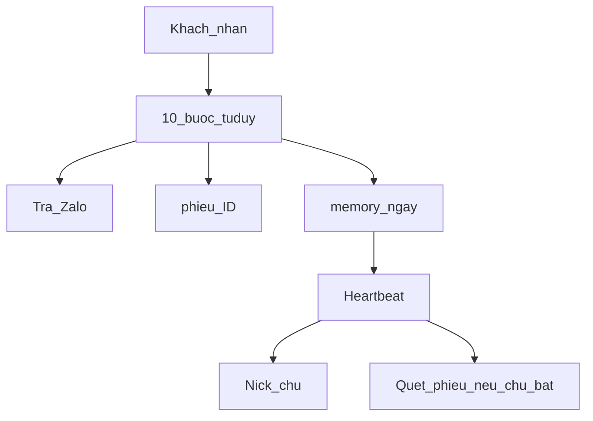
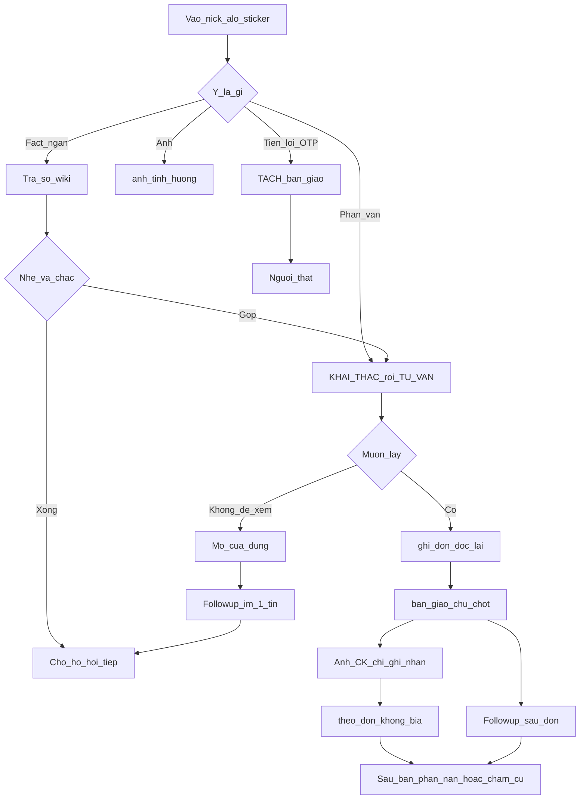

# Bản đồ vòng CSKH

Hai máy rời (`tuduy-cskh.md` = một tin; `khung-khai-thac.md` = pha hỏi) **không đủ** vòng đời. File này là cổng chung: vào nick → chọn → đơn → tiền → giao → sau bán → follow-up.

Skill là **cách hay**, không phải cổng bắt buộc. Không skill = không được bịa wiki.

## Hiện tại (phản ứng)

Khách nhắn → 10 bước `tuduy-cskh.md` → trả Zalo + phiếu + `memory/YYYY-MM-DD.md`. Heartbeat đọc ngày, **báo chủ** (thiếu wiki / bàn giao dở). Hai nhánh follow-up bên dưới là **ngoại lệ có rào** — không broadcast, không “Nami online”.

## Vòng đủ

| Cổng | Skill / file |
|---|---|
| Vào nick | `IDENTITY.md`, `giong-noi.md` |
| Fact ngắn | wiki + `tuduy-cskh.md` bước 6–7 |
| Phân vân | `khai-thac` → `bao-gia` / `cach-tu-van.md` |
| Ảnh | `doc-anh` + `anh-tinh-huong.md` |
| Tiền / OTP / lợi | `ban-giao` — TÁCH |
| Ghi đơn | `ghi-don` — **không** tự chốt |
| Chủ chốt | phiếu `da_chot_chu` — người thật |
| Ảnh CK | ghi nhận, **không** = đã nhận tiền, **không** kích hoạt sau-đơn |
| Theo đơn | `theo-don` — không bịa trạng thái |
| Phàn nàn / khách cũ | `xu-ly-phan-nan`, `cham-khach-cu` |
| Im sau giá / sau đơn | `follow-up` — một tin / nhánh, giờ trong `USER.md` |

## Follow-up (hai nhánh, có rào)

Không nài lần hai sau tin im. Không hỏi review nếu chủ chưa cho. Mặc định **tắt** nếu `USER.md` còn `[CHỜ CHỦ SHOP]`.

1. **Im sau giá** — phiếu có `da_bao_gia_luc` + họ im quá delay + `followup_im` ≠ `da_gui`/`tat`. Một tin mở cửa. Ghi `followup_im: da_gui`. Dừng nhánh này.
2. **Sau đơn** — phiếu có việc đơn thật (`cho_chot` sau ghi-đơn, hoặc `da_chot_chu` / `dang_giao` / `xong`). **Không** vì chỉ có ảnh CK. Delay + câu mẫu chủ. Một nhịp. Họ trả lời → `theo-don` hoặc `cham-khach-cu` / `xu-ly-phan-nan`.

Chi tiết máy: `skills/follow-up/SKILL.md`. Heartbeat quét `memory/phieu/*.md`, nhắn **đúng ID đó**.
